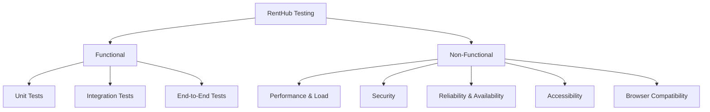

# RentHub — Full Project Testing Plan
## Functional & Non-Functional Coverage

> **Stack:** FastAPI (Python) · Next.js 15 (TypeScript/React) · PostgreSQL · Redis · WebSockets  
> **Existing tests:** `tests/test_auth.py`, `tests/test_health.py`, `tests/conftest.py`

---

## 1. Testing Strategy Overview



| Layer | Tool | Scope |
|---|---|---|
| **Backend Unit** | `pytest` + `pytest-asyncio` | Services, Repositories, Schemas |
| **Backend Integration** | `httpx` + `ASGITransport` | API routes + SQLite in-memory DB |
| **Frontend Unit** | `Jest` + `React Testing Library` | Components, Zustand stores, hooks |
| **E2E** | `Playwright` | Full user flows in real browser |
| **Load/Performance** | `Locust` / `k6` | API throughput, dashboard load |
| **Security** | `OWASP ZAP` + manual | Auth, input validation, rate limits |
| **Accessibility** | `axe-playwright` | WCAG 2.1 AA compliance |

---

## 2. Functional Testing

---

### 2.1 Authentication & Authorization

**Scope:** `/api/v1/auth/*` · `login/page.tsx` · `authStore.ts`

#### ✅ Already Covered (`test_auth.py`)
- [x] Register — success, duplicate email, weak password
- [x] Login — success, invalid credentials, inactive account
- [x] Token refresh
- [x] Logout
- [x] Email verification
- [x] Forgot/reset password

#### 🔲 Additional Test Cases Needed

| ID | Test Case | Type | Expected |
|---|---|---|---|
| AUTH-01 | Register with missing required fields | Integration | 422 Unprocessable Entity |
| AUTH-02 | Register with XSS payload in name | Integration | 400, sanitized or rejected |
| AUTH-03 | Login returns JWT access token (15 min expiry) | Integration | Token has correct exp claim |
| AUTH-04 | Refresh token after access token expiry | Integration | New access token issued |
| AUTH-05 | Refresh with tampered/expired refresh token | Integration | 401 Unauthorized |
| AUTH-06 | Google OAuth login — valid credential | Integration | User created, token returned |
| AUTH-07 | Google OAuth login — existing user re-auth | Integration | Existing user returned, no duplicate |
| AUTH-08 | Access protected route without token | Integration | 401 Unauthorized |
| AUTH-09 | Access protected route with expired token | Integration | 401, specific error code |
| AUTH-10 | Admin-only route accessed by customer role | Integration | 403 Forbidden |
| AUTH-11 | Owner-only route accessed by customer | Integration | 403 Forbidden |
| AUTH-12 | Login loading screen shows for 2.5s | E2E | Animation visible for ≥ 2.4s |
| AUTH-13 | Google button does NOT show spinner during email login | E2E | Google button remains static |
| AUTH-14 | `isLoading` state isolated between email and Google buttons | Unit (store) | Zustand state does not bleed |
| AUTH-15 | Login redirects to `returnUrl` for public action flows | E2E | Correct destination URL |
| AUTH-16 | Password reset link expires after 1 use | Integration | 400 on second use |

---

### 2.2 User Profile & Roles

**Scope:** `/api/v1/users/*` · `/dashboard/profile`

| ID | Test Case | Type | Expected |
|---|---|---|---|
| USER-01 | Get current user (`GET /users/me`) | Integration | Returns full user object |
| USER-02 | Update profile — first name, last name, phone | Integration | 200, updated fields reflected |
| USER-03 | Upload avatar image — valid JPEG/PNG ≤ 10MB | Integration | 200, `avatar_url` updated |
| USER-04 | Upload avatar — file too large (>10MB) | Integration | 413 Payload Too Large |
| USER-05 | Upload avatar — invalid file type (PDF) | Integration | 400 Bad Request |
| USER-06 | Toggle active role: customer ↔ owner | Unit (store) | `activeRole` switches correctly |
| USER-07 | Deactivated user cannot log in | Integration | 403 with reason |
| USER-08 | Profile page renders correctly for both roles | E2E | Role-appropriate nav shown |
| USER-09 | Change password — correct old password | Integration | 200, new password works |
| USER-10 | Change password — wrong old password | Integration | 400 Forbidden |

---

### 2.3 Products / Listings

**Scope:** `/api/v1/products/*` · `/listings` · `/products/[id]`

| ID | Test Case | Type | Expected |
|---|---|---|---|
| PROD-01 | Create listing — all required fields | Integration | 201, listing returned |
| PROD-02 | Create listing — missing price | Integration | 422 |
| PROD-03 | Create listing — negative price | Integration | 422 |
| PROD-04 | Create listing — non-owner user | Integration | 403 |
| PROD-05 | Get all listings — paginated | Integration | `items`, `total`, `page` in response |
| PROD-06 | Get listing by ID | Integration | 200 with full details |
| PROD-07 | Get listing by non-existent ID | Integration | 404 |
| PROD-08 | Update own listing | Integration | 200, changes persisted |
| PROD-09 | Update another owner's listing | Integration | 403 |
| PROD-10 | Delete own listing | Integration | 204 |
| PROD-11 | Search listings by keyword | Integration | Matching items returned |
| PROD-12 | Filter by category slug | Integration | Only category products returned |
| PROD-13 | Filter by city | Integration | Location-filtered results |
| PROD-14 | Filter by price range | Integration | `min_price` / `max_price` respected |
| PROD-15 | Upload product images (multi-image) | Integration | All image URLs stored |
| PROD-16 | Mark listing as unavailable | Integration | Status = `inactive` |
| PROD-17 | Product detail page loads with correct data | E2E | Name, price, images visible |
| PROD-18 | Recently viewed tracked per user | Integration | `/users/recently-viewed` updated |
| PROD-19 | Trending filter returns correct products | Integration | `trending=true` param respected |

---

### 2.4 Bookings

**Scope:** `/api/v1/bookings/*` · `/bookings`

| ID | Test Case | Type | Expected |
|---|---|---|---|
| BOOK-01 | Create booking — available product, valid dates | Integration | 201, status=`pending` |
| BOOK-02 | Create booking — unavailable dates | Integration | 409 Conflict |
| BOOK-03 | Create booking — past start date | Integration | 422 |
| BOOK-04 | Create booking — end before start | Integration | 422 |
| BOOK-05 | Owner approves booking | Integration | status → `confirmed` |
| BOOK-06 | Owner rejects booking | Integration | status → `rejected` |
| BOOK-07 | Customer cancels pending booking | Integration | status → `cancelled` |
| BOOK-08 | Customer cancels confirmed booking (within policy) | Integration | Refund initiated |
| BOOK-09 | Booking auto-expires if unpaid after timeout | Integration | status → `expired` |
| BOOK-10 | Booking list — customer sees only own bookings | Integration | Correct user filter |
| BOOK-11 | Booking list — owner sees all their product bookings | Integration | Correct owner filter |
| BOOK-12 | Upcoming booking widget shows next booking | E2E | Widget renders date + product |
| BOOK-13 | Double booking same product, same dates blocked | Integration | 409 on second request |
| BOOK-14 | Booking creates notification for owner | Integration | Notification record created |

---

### 2.5 Payments

**Scope:** `/api/v1/payments/*` · `/payments`

| ID | Test Case | Type | Expected |
|---|---|---|---|
| PAY-01 | Create payment for booking | Integration | 201, `payment_id` returned |
| PAY-02 | Payment with invalid booking ID | Integration | 404 |
| PAY-03 | Duplicate payment for same booking | Integration | 400 Already paid |
| PAY-04 | Payment status webhook — success | Integration | Booking confirmed |
| PAY-05 | Payment status webhook — failed | Integration | Booking status → `payment_failed` |
| PAY-06 | Get payment history — customer | Integration | Returns own payments only |
| PAY-07 | Payment detail page shows correct amount | E2E | Amount matches booking total |
| PAY-08 | Payment record with correct currency and platform fee | Integration | Fee calculation accurate |

---

### 2.6 Payouts

**Scope:** `/api/v1/payouts/*` · `/payouts`

| ID | Test Case | Type | Expected |
|---|---|---|---|
| POUT-01 | Owner requests payout — sufficient balance | Integration | 201, payout queued |
| POUT-02 | Owner requests payout — insufficient balance | Integration | 400 Insufficient funds |
| POUT-03 | Admin approves payout | Integration | status → `completed` |
| POUT-04 | Admin rejects payout | Integration | status → `rejected`, balance restored |
| POUT-05 | Payout history page — owner sees own records | E2E | Correct records displayed |
| POUT-06 | Payout cannot be requested by customer role | Integration | 403 |

---

### 2.7 Reviews & Ratings

**Scope:** `/api/v1/reviews/*` · `/reviews`

| ID | Test Case | Type | Expected |
|---|---|---|---|
| REV-01 | Submit review — completed booking | Integration | 201, review stored |
| REV-02 | Submit review — booking not completed | Integration | 403 Not eligible |
| REV-03 | Submit duplicate review | Integration | 409 Already reviewed |
| REV-04 | Rating outside 1–5 range | Integration | 422 |
| REV-05 | Get reviews for a product — paginated | Integration | Correct product reviews |
| REV-06 | Average rating recalculated after new review | Integration | Product rating updated |
| REV-07 | Review with XSS comment content | Integration | Content sanitized |
| REV-08 | Reviews visible on product detail page | E2E | Star rating + comment shown |

---

### 2.8 Messaging & Notifications

**Scope:** `/api/v1/messages/*` · `/api/v1/notifications/*` · WebSocket `/ws`

| ID | Test Case | Type | Expected |
|---|---|---|---|
| MSG-01 | Send message — valid conversation | Integration | 201, message stored |
| MSG-02 | Send message — unauthenticated | Integration | 401 |
| MSG-03 | Get conversation messages — paginated | Integration | Correct thread returned |
| MSG-04 | WebSocket connects on authentication | E2E | Connection established |
| MSG-05 | Real-time message appears without refresh | E2E | Message appears in <1s |
| MSG-06 | Notification created on new message | Integration | Notification record in DB |
| NOTIF-01 | Get notifications list — unread count correct | Integration | Unread count matches |
| NOTIF-02 | Mark notification as read | Integration | 200, `is_read=true` |
| NOTIF-03 | Mark all notifications as read | Integration | All records updated |
| NOTIF-04 | Notification dropdown shows in dashboard header | E2E | Bell icon + dropdown functional |

---

### 2.9 Identity Verification

**Scope:** `/api/v1/identity-verification/*` · `/verify-identity`

| ID | Test Case | Type | Expected |
|---|---|---|---|
| IDV-01 | Submit verification — valid NID + selfie | Integration | 201, status=`pending` |
| IDV-02 | Submit verification — file too large | Integration | 413 |
| IDV-03 | Submit verification — unsupported format | Integration | 400 |
| IDV-04 | Face match above threshold → auto-approve | Integration | status=`approved` |
| IDV-05 | Face match between thresholds → manual review | Integration | status=`manual_review` |
| IDV-06 | Face match below min threshold → rejected | Integration | status=`rejected` |
| IDV-07 | Exceed max retry attempts (3) | Integration | Locked, 429 |
| IDV-08 | Admin views pending verifications | Integration | 200, list returned |
| IDV-09 | Admin approves verification | Integration | status→`approved`, user flags updated |
| IDV-10 | Admin rejects verification with reason | Integration | status→`rejected`, reason stored |
| IDV-11 | Verified user badge visible on profile | E2E | ✓ badge displayed |
| IDV-12 | Encryption of stored ID documents | Unit | Data encrypted at rest |

---

### 2.10 Analytics & Dashboard

**Scope:** `/api/v1/analytics/*` · `CustomerDashboard.tsx` · `OwnerDashboard.tsx`

| ID | Test Case | Type | Expected |
|---|---|---|---|
| ANLT-01 | Owner stats returns correct totals | Integration | `total_listings`, `monthly_earnings` |
| ANLT-02 | Earnings chart has correct date range | Integration | Monthly data points present |
| ANLT-03 | Booking trend data populated | Integration | Trend array non-empty |
| ANLT-04 | Customer dashboard shows trending products | E2E | Product cards rendered |
| ANLT-05 | Owner dashboard KPI cards match API data | E2E | Numbers match |
| ANLT-06 | Dashboard loading screen appears on first load | E2E | Animation visible before content |
| ANLT-07 | Dashboard loads within 3s on normal connection | E2E (Perf) | LCP ≤ 3s |

---

### 2.11 CMS (Hero Slides, Categories, Cities, Deals)

**Scope:** `/api/v1/cms/*`

| ID | Test Case | Type | Expected |
|---|---|---|---|
| CMS-01 | Get hero slides | Integration | Array of banner objects |
| CMS-02 | Get categories list | Integration | Slug, name, icon_url |
| CMS-03 | Get cities list | Integration | Array of city objects |
| CMS-04 | Get deals list | Integration | Deal objects with discount info |
| CMS-05 | Admin creates hero slide | Integration | 201, slide stored |
| CMS-06 | Admin deletes hero slide | Integration | 204, removed from DB |
| CMS-07 | Category grid renders correct count | E2E | +1 for "More" category |

---

### 2.12 Categories (Browsing)

**Scope:** `/api/v1/categories` · `/categories/[slug]`

| ID | Test Case | Type | Expected |
|---|---|---|---|
| CAT-01 | List all categories | Integration | Paginated list |
| CAT-02 | Get category by valid slug | Integration | 200, products listed |
| CAT-03 | Get category by invalid slug | Integration | 404 |
| CAT-04 | Category page renders products | E2E | Product grid visible |
| CAT-05 | Admin creates category with icon | Integration | 201, icon_url stored |
| CAT-06 | Admin updates category name | Integration | 200, change reflected |
| CAT-07 | Admin deletes category | Integration | 204, associated listings unlinked |

---

### 2.13 Lister Applications (Become an Owner)

**Scope:** `/api/v1/lister-applications/*` · `/become-lister`

| ID | Test Case | Type | Expected |
|---|---|---|---|
| LIST-01 | Customer submits lister application | Integration | 201, status=`pending` |
| LIST-02 | Submit duplicate application | Integration | 409 Already submitted |
| LIST-03 | Admin approves application | Integration | User role updated to `owner` |
| LIST-04 | Admin rejects application | Integration | status=`rejected` |
| LIST-05 | Become-lister page form validation | E2E | Required fields enforced |

---

### 2.14 Wishlist & Cart

**Scope:** `/wishlist` · `/cart` · `wishlistStore.ts`

| ID | Test Case | Type | Expected |
|---|---|---|---|
| WISH-01 | Add product to wishlist | Unit (store) | Item added to Zustand store |
| WISH-02 | Remove product from wishlist | Unit (store) | Item removed |
| WISH-03 | Wishlist persists across page refresh | E2E | Items still present |
| CART-01 | Add product to cart | E2E | Cart count incremented |
| CART-02 | Remove product from cart | E2E | Item removed, total updated |
| CART-03 | Checkout redirects to login if unauthenticated | E2E | Redirect to `/login?returnUrl=/cart` |

---

### 2.15 Search

**Scope:** `/search` · `/api/v1/products?q=`

| ID | Test Case | Type | Expected |
|---|---|---|---|
| SRCH-01 | Search by keyword — results returned | Integration | Matching products listed |
| SRCH-02 | Search with no results | Integration | Empty array, `total: 0` |
| SRCH-03 | Search with SQL injection payload | Integration | Sanitized, no data leak |
| SRCH-04 | Search results page renders correctly | E2E | Products displayed |
| SRCH-05 | Search with special characters (é, ক, #) | Integration | No 500 error |

---

### 2.16 Health & Infrastructure

**Scope:** `/api/v1/health` · `test_health.py`

| ID | Test Case | Type | Expected |
|---|---|---|---|
| HLTH-01 | Health endpoint returns 200 | Integration | `status: ok` |
| HLTH-02 | Health includes DB and Redis status | Integration | Both connected |
| HLTH-03 | Health endpoint accessible without auth | Integration | No 401 |

---

## 3. Non-Functional Testing

---

### 3.1 Performance & Load Testing

**Tool:** Locust or k6

#### API Throughput Targets

| Endpoint Group | Target RPS | Max P99 Latency |
|---|---|---|
| `GET /products` (browse) | 500 RPS | < 300ms |
| `POST /auth/login` | 100 RPS | < 500ms |
| `GET /bookings` | 200 RPS | < 400ms |
| `GET /analytics/owner-stats` | 50 RPS | < 1000ms |
| `WebSocket /ws` (concurrent) | 1,000 connections | < 100ms message delivery |

#### Test Scenarios

| ID | Scenario | Duration | Users | Pass Criteria |
|---|---|---|---|---|
| PERF-01 | Baseline load — browse listings | 5 min | 50 concurrent | Error rate < 1% |
| PERF-02 | Peak load — all endpoints mix | 15 min | 500 concurrent | P99 < 1s |
| PERF-03 | Spike test — sudden 1000 users | 2 min burst | 1000 | No 500 errors |
| PERF-04 | Soak test — sustained normal load | 1 hour | 100 | No memory leaks |
| PERF-05 | Dashboard initial load (LCP) | — | 1 user | LCP ≤ 2.5s |
| PERF-06 | Login + redirect full flow | — | 1 user | Total ≤ 4s |
| PERF-07 | Database query: product search with 10k records | — | — | < 200ms |
| PERF-08 | Redis cache hit rate for repeated GET requests | — | — | ≥ 80% cache hit |

---

### 3.2 Security Testing

**Tools:** OWASP ZAP, manual penetration testing, Bandit (Python SAST)

| ID | Test Case | Method | Pass Criteria |
|---|---|---|---|
| SEC-01 | **SQL Injection** — all user inputs | Automated (ZAP) | No data returned, no 500 |
| SEC-02 | **XSS** — review comments, search fields | Automated (ZAP) | Scripts not executed |
| SEC-03 | **CSRF** — state-changing endpoints | Manual | Requests without valid token rejected |
| SEC-04 | **JWT token tampering** | Manual | 401 on modified token |
| SEC-05 | **JWT algorithm confusion** (none alg attack) | Manual | Server rejects `alg: none` |
| SEC-06 | **Brute force login** — rate limiting triggers | Manual | 429 after 200 req/min (per config) |
| SEC-07 | **Insecure Direct Object Reference** — access other user's booking | Manual | 403 Forbidden |
| SEC-08 | **Mass assignment** — inject `is_admin: true` in register | Manual | Field ignored, not elevated |
| SEC-09 | **Sensitive data in error responses** — stack traces | Automated | No stack traces in production |
| SEC-10 | **HTTPS enforcement** — HTTP requests | Manual | Redirect to HTTPS |
| SEC-11 | **Password stored as bcrypt** (12 rounds) | Unit | Hash starts with `$2b$12$` |
| SEC-12 | **Refresh token rotation** — old token invalid after refresh | Integration | 401 on reuse |
| SEC-13 | **File upload validation** — execute script disguised as image | Integration | 400, file rejected |
| SEC-14 | **CORS policy** — untrusted origin rejected | Integration | No CORS headers for unknown origin |
| SEC-15 | **Identity documents encrypted at rest** | Unit | Encrypted bytes in DB |
| SEC-16 | **API docs disabled in production** | Config Check | `/docs` returns 404 |

---

### 3.3 Reliability & Error Handling

| ID | Test Case | Method | Pass Criteria |
|---|---|---|---|
| REL-01 | Backend restarts cleanly (Uvicorn reload) | Manual | No data loss |
| REL-02 | Database connection pool exhausted | Load test | Graceful 503, no crash |
| REL-03 | Redis unavailable — app continues (degraded) | Manual (kill Redis) | Non-cached routes still work |
| REL-04 | External email service down — registration continues | Integration (mock) | User created, email queued |
| REL-05 | S3/storage unavailable — upload fails gracefully | Integration (mock) | 503 with clear error message |
| REL-06 | WebSocket drops — client reconnects | E2E | Auto-reconnect in < 5s |
| REL-07 | Frontend API error displayed — not blank screen | E2E | Error message visible |
| REL-08 | 500 errors caught by error boundary | E2E | `error.tsx` component shown |
| REL-09 | Concurrent booking creation — no race condition | Integration | Only one booking succeeds |
| REL-10 | Database transaction rollback on partial failure | Unit | No orphaned records |

---

### 3.4 Scalability

| ID | Test Case | Method | Pass Criteria |
|---|---|---|---|
| SCAL-01 | Horizontal scaling — 2 backend instances | Load test | Requests distributed evenly |
| SCAL-02 | Database connection pooling (pool_size=10, overflow=20) | Load test | No `TimeoutError` under 30 concurrent |
| SCAL-03 | Pagination prevents full-table scans | Integration | `LIMIT`/`OFFSET` verified in queries |
| SCAL-04 | Large dataset search (100k products) | Performance | Response < 500ms with index |

---

### 3.5 Accessibility (WCAG 2.1 AA)

**Tool:** `axe-playwright`, manual keyboard navigation

| ID | Test Case | Method | Pass Criteria |
|---|---|---|---|
| A11Y-01 | Login page — keyboard-only navigation | Manual | Tab order logical, no focus traps |
| A11Y-02 | Login page — screen reader labels | axe | All inputs have `label`/`aria-label` |
| A11Y-03 | Dashboard — color contrast ratio | axe | ≥ 4.5:1 for normal text |
| A11Y-04 | Loading screen `role="status"` + `aria-label` | Code Review | Attribute present ✅ |
| A11Y-05 | Image alt attributes — product images | axe | All `` have descriptive `alt` |
| A11Y-06 | Error messages announced to screen readers | Manual | `aria-live` or focus moved |
| A11Y-07 | Modal dialogs — focus trap and ESC close | E2E | Focus contained, ESC dismisses |
| A11Y-08 | Skip to main content link | Manual | Present, functional |
| A11Y-09 | Form validation errors linked to inputs | Code Review | `aria-describedby` used |

---

### 3.6 Browser & Device Compatibility

| Browser / Device | Min Version | Target Pages |
|---|---|---|
| Chrome | 120+ | All pages |
| Firefox | 120+ | All pages |
| Safari | 17+ | All pages |
| Edge | 120+ | All pages |
| Safari iOS | 16+ | Mobile responsive views |
| Chrome Android | 120+ | Mobile responsive views |

**Test Matrix:**

| ID | Test Case | Method |
|---|---|---|
| COMP-01 | Login page renders correctly on Safari | Manual |
| COMP-02 | Dashboard layout correct on 375px (mobile) | Manual/Playwright |
| COMP-03 | Loading animation SVG renders across browsers | Manual |
| COMP-04 | Product image gallery responsive | Manual |
| COMP-05 | WebSocket connections work on Safari iOS | Manual |

---

### 3.7 Usability

| ID | Test Case | Method | Pass Criteria |
|---|---|---|---|
| UX-01 | Login loading animation visible for ≥ 2.4s | E2E | `LoginLoadingScreen` shows duration |
| UX-02 | Dashboard loading screen shows while API loads | E2E | Screen visible until data ready |
| UX-03 | Google button DOES NOT spin during email login | E2E | Independent loading state confirmed |
| UX-04 | Error messages are human-readable (not raw JSON) | E2E | Friendly message shown |
| UX-05 | All CTAs have hover feedback | Manual | Scale/color change on hover |
| UX-06 | Page transitions smooth (no flicker) | Manual | No white flash between routes |

---

## 4. Test Data Strategy

| Data Type | Approach |
|---|---|
| User accounts | Seeded via `seed.py` — customer + owner + admin |
| Products | Seeded via `seed_extended.py` / `seed_vehicles.py` |
| Bookings | Seeded via `seed_payments.py` |
| Test DB | SQLite in-memory per test function (via `conftest.py`) |
| Sensitive files | Mock objects (no real NID images in tests) |
| Email service | Mocked via `unittest.mock.AsyncMock` |

---

## 5. Priority Matrix

| Priority | Test Area | Why |
|---|---|---|
| 🔴 Critical | Auth, Bookings, Payments | Core revenue + security |
| 🔴 Critical | Security (SQL Injection, JWT, IDOR) | User data protection |
| 🟠 High | Identity Verification | Legal compliance |
| 🟠 High | Owner Dashboard Analytics | Owner retention |
| 🟡 Medium | Reviews, Messaging, Notifications | Engagement features |
| 🟡 Medium | Performance / Load | Production readiness |
| 🟢 Normal | CMS, Categories, Search | Content discovery |
| 🟢 Normal | Accessibility, Compatibility | Inclusion + reach |

---

## 6. CI/CD Integration

```yaml
# Suggested GitHub Actions pipeline
test:
  - name: Backend Tests
    run: |
      cd backend
      source .venv/bin/activate
      pytest tests/ -v --asyncio-mode=auto --cov=app --cov-report=xml

  - name: Frontend Type Check
    run: |
      cd frontend
      npx tsc --noEmit

  - name: Frontend Unit Tests
    run: |
      cd frontend
      npm test -- --coverage

  - name: E2E Tests (Playwright)
    run: |
      npx playwright test --project=chromium

  - name: Security Scan (Bandit)
    run: |
      cd backend
      bandit -r app/ -ll
```

**Coverage Targets:**

| Layer | Minimum Coverage |
|---|---|
| Backend (pytest) | ≥ 80% |
| Frontend (Jest) | ≥ 70% |
| E2E critical flows | 100% of flows in §2.1–2.6 |

---

## 7. Defect Reporting Template

```
Title: [Module] - [Short description]
Severity: Critical / High / Medium / Low
Steps to Reproduce:
  1. ...
  2. ...
Expected: ...
Actual: ...
Environment: dev / staging / prod
Browser / OS: ...
Screenshot / Log: [attach]
```

---

## 8. Test Execution Checklist (Pre-Release)

- [ ] All `pytest` tests pass with 0 failures
- [ ] TypeScript build succeeds (`tsc --noEmit` exit 0)
- [ ] All Critical + High priority test cases executed
- [ ] No open P0/P1 defects
- [ ] Load test: P99 latency within targets
- [ ] Security scan: no HIGH/CRITICAL findings (OWASP ZAP)
- [ ] Accessibility: 0 critical axe violations
- [ ] Login loading screen verified on Chrome + Safari
- [ ] Dashboard loading screen verified after fresh login
- [ ] Google button spinner isolated from email login confirmed

---

*Plan version: 1.0 | Updated: 2026-09-15 | Project: RentHub v1.0.0*
